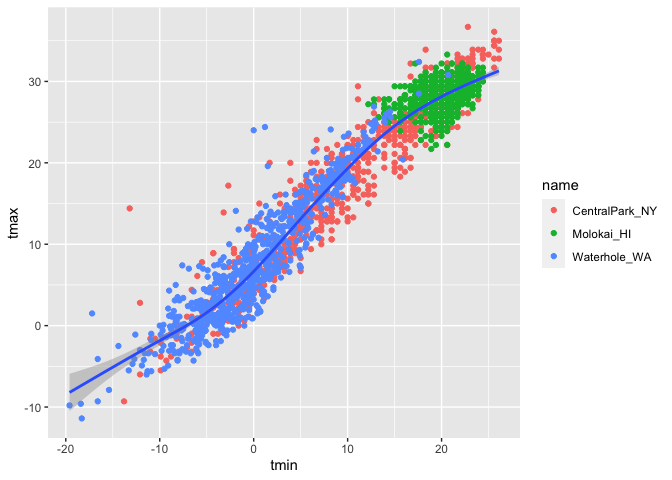
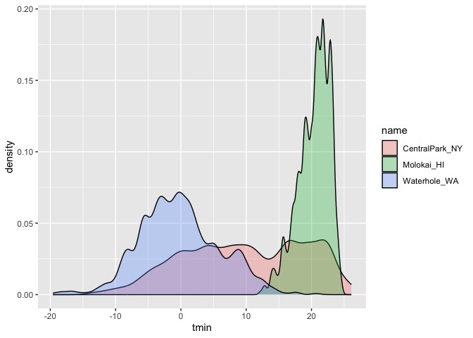
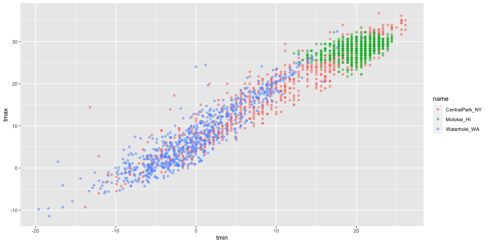

Visualization
================

``` r
library(tidyverse) #the functions exist in tidyverse but not basic R)
```

    ## ── Attaching core tidyverse packages ──────────────────────── tidyverse 2.0.0 ──
    ## ✔ dplyr     1.1.3     ✔ readr     2.1.4
    ## ✔ forcats   1.0.0     ✔ stringr   1.5.0
    ## ✔ ggplot2   3.4.3     ✔ tibble    3.2.1
    ## ✔ lubridate 1.9.2     ✔ tidyr     1.3.0
    ## ✔ purrr     1.0.2     
    ## ── Conflicts ────────────────────────────────────────── tidyverse_conflicts() ──
    ## ✖ dplyr::filter() masks stats::filter()
    ## ✖ dplyr::lag()    masks stats::lag()
    ## ℹ Use the conflicted package (<http://conflicted.r-lib.org/>) to force all conflicts to become errors

``` r
library(ggridges)
```

``` r
weather_df = 
  rnoaa::meteo_pull_monitors(
    c("USW00094728", "USW00022534", "USS0023B17S"), #3 monitor stations to pull (allow to access data online)
    var = c("PRCP", "TMIN", "TMAX"), # several variables
    date_min = "2021-01-01", #begin date
    date_max = "2022-12-31") |> #end date
  mutate( #reorganize the dataset
    name = recode(
      id, 
      USW00094728 = "CentralPark_NY",
      USW00022534 = "Molokai_HI",
      USS0023B17S = "Waterhole_WA"),
    tmin = tmin / 10, #data manipulation
    tmax = tmax / 10) |> #change the temperature unit to Celcius
  select(name, id, everything()) #select process
```

    ## using cached file: /Users/ruijiehe/Library/Caches/org.R-project.R/R/rnoaa/noaa_ghcnd/USW00094728.dly

    ## date created (size, mb): 2023-10-07 23:56:41.321619 (0.343)

    ## file min/max dates: 2021-01-01 / 2023-10-31

    ## using cached file: /Users/ruijiehe/Library/Caches/org.R-project.R/R/rnoaa/noaa_ghcnd/USW00022534.dly

    ## date created (size, mb): 2023-10-07 23:56:43.110858 (0.282)

    ## file min/max dates: 2021-01-01 / 2023-10-31

    ## using cached file: /Users/ruijiehe/Library/Caches/org.R-project.R/R/rnoaa/noaa_ghcnd/USS0023B17S.dly

    ## date created (size, mb): 2023-10-07 23:56:43.945103 (0.122)

    ## file min/max dates: 2021-01-01 / 2023-10-31

``` r
weather_df
```

    ## # A tibble: 2,190 × 6
    ##    name           id          date        prcp  tmax  tmin
    ##    <chr>          <chr>       <date>     <dbl> <dbl> <dbl>
    ##  1 CentralPark_NY USW00094728 2021-01-01   157   4.4   0.6
    ##  2 CentralPark_NY USW00094728 2021-01-02    13  10.6   2.2
    ##  3 CentralPark_NY USW00094728 2021-01-03    56   3.3   1.1
    ##  4 CentralPark_NY USW00094728 2021-01-04     5   6.1   1.7
    ##  5 CentralPark_NY USW00094728 2021-01-05     0   5.6   2.2
    ##  6 CentralPark_NY USW00094728 2021-01-06     0   5     1.1
    ##  7 CentralPark_NY USW00094728 2021-01-07     0   5    -1  
    ##  8 CentralPark_NY USW00094728 2021-01-08     0   2.8  -2.7
    ##  9 CentralPark_NY USW00094728 2021-01-09     0   2.8  -4.3
    ## 10 CentralPark_NY USW00094728 2021-01-10     0   5    -1.6
    ## # ℹ 2,180 more rows

## Scatterplot

Create my first scatterplot ever.

``` r
ggplot(weather_df, aes(x = tmin, y = tmax )) + #variable map to x feature
  geom_point() #gives the scatterplot
```

    ## Warning: Removed 17 rows containing missing values (`geom_point()`).

<!-- -->

Same way to do this

``` r
weather_df %>% #gives the same plot as above
  ggplot(aes(x =tmin, y = tmax)) +
  geom_point()
```

    ## Warning: Removed 17 rows containing missing values (`geom_point()`).

<!-- -->

Another way to interact with `ggplot` (save and edit a plot object)

``` r
weather_plot =
  weather_df %>% 
  ggplot(aes(x =tmin, y = tmax))

weather_plot + geom_point()
```

    ## Warning: Removed 17 rows containing missing values (`geom_point()`).

<!-- -->

## Asvanced scatterplot

**Start with the same one and make it fancy!**

``` r
weather_df %>% 
  ggplot(aes(x =tmin, y = tmax, color = name)) +
  geom_point()
```

    ## Warning: Removed 17 rows containing missing values (`geom_point()`).

<!-- -->

``` r
# get better visual information
```

Add a new geometry

``` r
weather_df %>% 
  ggplot(aes(x =tmin, y = tmax, color = name)) +
  geom_point() +
  geom_smooth(se = FALSE) #se stands for "standard error"
```

    ## `geom_smooth()` using method = 'loess' and formula = 'y ~ x'

    ## Warning: Removed 17 rows containing non-finite values (`stat_smooth()`).

    ## Warning: Removed 17 rows containing missing values (`geom_point()`).

<!-- -->

What about the `aes` placement?

**What does `geom_smooth` do?**

``` r
weather_df %>% 
  ggplot(aes(x =tmin, y = tmax)) +
  geom_point(aes(color = name)) + #color only apply to the scatterplots but not the smooth line
  geom_smooth()
```

    ## `geom_smooth()` using method = 'gam' and formula = 'y ~ s(x, bs = "cs")'

    ## Warning: Removed 17 rows containing non-finite values (`stat_smooth()`).

    ## Warning: Removed 17 rows containing missing values (`geom_point()`).

<!-- -->

Lect’s facet some things!

``` r
weather_df %>% 
  ggplot(aes(x =tmin, y = tmax, alpha = tmin, color = name)) +
  geom_point() + #change the transparency and size of geom_points
  geom_smooth(se = FALSE) +
  facet_grid(. ~ name) #grid(rows ~ columns)
```

    ## `geom_smooth()` using method = 'loess' and formula = 'y ~ x'

    ## Warning: Removed 17 rows containing non-finite values (`stat_smooth()`).

    ## Warning: The following aesthetics were dropped during statistical transformation: alpha
    ## ℹ This can happen when ggplot fails to infer the correct grouping structure in
    ##   the data.
    ## ℹ Did you forget to specify a `group` aesthetic or to convert a numerical
    ##   variable into a factor?
    ## The following aesthetics were dropped during statistical transformation: alpha
    ## ℹ This can happen when ggplot fails to infer the correct grouping structure in
    ##   the data.
    ## ℹ Did you forget to specify a `group` aesthetic or to convert a numerical
    ##   variable into a factor?
    ## The following aesthetics were dropped during statistical transformation: alpha
    ## ℹ This can happen when ggplot fails to infer the correct grouping structure in
    ##   the data.
    ## ℹ Did you forget to specify a `group` aesthetic or to convert a numerical
    ##   variable into a factor?

    ## Warning: Removed 17 rows containing missing values (`geom_point()`).

<!-- -->

``` r
#Got single plot panel and smooth curve for each data
```

Let’s combine some elements and try a new plot

``` r
weather_df %>% 
  ggplot(aes(x = date, y = tmax, color = name)) +
  geom_point(aes(size = prcp), alpha = 0.5) +
  geom_smooth(se = FALSE) +
  facet_grid(. ~ name)
```

    ## `geom_smooth()` using method = 'loess' and formula = 'y ~ x'

    ## Warning: Removed 17 rows containing non-finite values (`stat_smooth()`).

    ## Warning: Removed 19 rows containing missing values (`geom_point()`).

<!-- -->

## Some small notes

How many geoms have to exist?

> You can have whatever geoms you want.

The `geom_point` is not necessary, the `geom_smooth` can exist along but
only gives the smooth curve not the points.

``` r
weather_df %>% 
  ggplot(aes(x = tmin, y = tmax, color = name)) +
  geom_smooth(se= FALSE)
```

    ## `geom_smooth()` using method = 'loess' and formula = 'y ~ x'

    ## Warning: Removed 17 rows containing non-finite values (`stat_smooth()`).

<!-- -->

Import the new package neat geom (`geom_hex`)

``` r
weather_df %>% 
  ggplot(aes(x = tmin, y = tmax)) +
  geom_hex() #Helps understanding the distribution of plots
```

    ## Warning: Removed 17 rows containing non-finite values (`stat_binhex()`).

<!-- -->

`geom_bin2d` same as above but squared

``` r
weather_df %>% 
  ggplot(aes(x = tmin, y = tmax)) +
  geom_bin2d()
```

    ## Warning: Removed 17 rows containing non-finite values (`stat_bin2d()`).

<!-- -->

`geom_density2d` gives (countor plot) information about elevation

``` r
weather_df %>% 
  ggplot(aes(x = tmin, y = tmax)) +
  geom_density2d()
```

    ## Warning: Removed 17 rows containing non-finite values (`stat_density2d()`).

<!-- -->

``` r
weather_df %>% 
  ggplot(aes(x = tmin, y = tmax)) +
  geom_density2d() +
  geom_point(alpha = 0.3) #Add points
```

    ## Warning: Removed 17 rows containing non-finite values (`stat_density2d()`).

    ## Warning: Removed 17 rows containing missing values (`geom_point()`).

<!-- -->

**Done with small notes on `ggplot`**

## Unvariate plots

**Histograms** are really great

``` r
weather_df %>% 
  ggplot(aes(x = tmin)) +
  geom_histogram()
```

    ## `stat_bin()` using `bins = 30`. Pick better value with `binwidth`.

    ## Warning: Removed 17 rows containing non-finite values (`stat_bin()`).

<!-- -->

Can we add color ..

``` r
weather_df %>% 
  ggplot(aes(x = tmin, fill = name)) +
  geom_histogram(position = "dodge")
```

    ## `stat_bin()` using `bins = 30`. Pick better value with `binwidth`.

    ## Warning: Removed 17 rows containing non-finite values (`stat_bin()`).

<!-- -->

``` r
weather_df %>% 
  ggplot(aes(x = tmin, fill = name)) +
  geom_histogram() +
  facet_grid(. ~ name)
```

    ## `stat_bin()` using `bins = 30`. Pick better value with `binwidth`.

    ## Warning: Removed 17 rows containing non-finite values (`stat_bin()`).

<!-- -->

``` r
weather_df %>% 
  ggplot(aes(x = tmin)) +
  geom_histogram() +
  facet_grid(. ~ name)
```

    ## `stat_bin()` using `bins = 30`. Pick better value with `binwidth`.

    ## Warning: Removed 17 rows containing non-finite values (`stat_bin()`).

<!-- -->

``` r
weather_df %>% 
  ggplot(aes(x = tmin)) +
  geom_histogram() +
  facet_grid(. ~ name)
```

    ## `stat_bin()` using `bins = 30`. Pick better value with `binwidth`.

    ## Warning: Removed 17 rows containing non-finite values (`stat_bin()`).

<!-- -->

Lest’s try a new geometry!

`geom_density` is to smooth down the edge of histogram

``` r
weather_df %>% 
  ggplot(aes(x = tmin, fill =name)) +
  geom_density(alpha = 0.3, adjust = 0.5)
```

    ## Warning: Removed 17 rows containing non-finite values (`stat_density()`).

<!-- -->

What about `boxplots`?

``` r
weather_df %>% 
  ggplot(aes(x = name, y = tmin)) +
  geom_boxplot()
```

    ## Warning: Removed 17 rows containing non-finite values (`stat_boxplot()`).

<!-- -->

## Trendy plots

`geom violin`

``` r
weather_df %>% 
  ggplot(aes(x = name, y = tmin, fill = name)) +
  geom_violin(alpha = 0.5) +
  stat_summary(fun = "mean")
```

    ## Warning: Removed 17 rows containing non-finite values (`stat_ydensity()`).

    ## Warning: Removed 17 rows containing non-finite values (`stat_summary()`).

    ## Warning: Removed 3 rows containing missing values (`geom_segment()`).

<!-- -->

Ridge plots – the most popular plot of 2017

``` r
weather_df %>% 
  ggplot(aes(x = tmin, y = name)) +
  geom_density_ridges()
```

    ## Picking joint bandwidth of 1.41

    ## Warning: Removed 17 rows containing non-finite values
    ## (`stat_density_ridges()`).

<!-- -->

## Save and embed

Let’s save a scatterplot

``` r
weather_plot =
  weather_df %>% 
  ggplot(aes(x = tmin, y = tmax, color = name)) +
  geom_point(alpha =0.5)

ggsave("./results/weather_plot.pdf", weather_plot, width = 8, height =5)
```

    ## Warning: Removed 17 rows containing missing values (`geom_point()`).

What about embedding?

``` r
weather_plot
```

    ## Warning: Removed 17 rows containing missing values (`geom_point()`).

<!-- -->

Embed at a different size

``` r
weather_plot
```

    ## Warning: Removed 17 rows containing missing values (`geom_point()`).

<!-- -->
